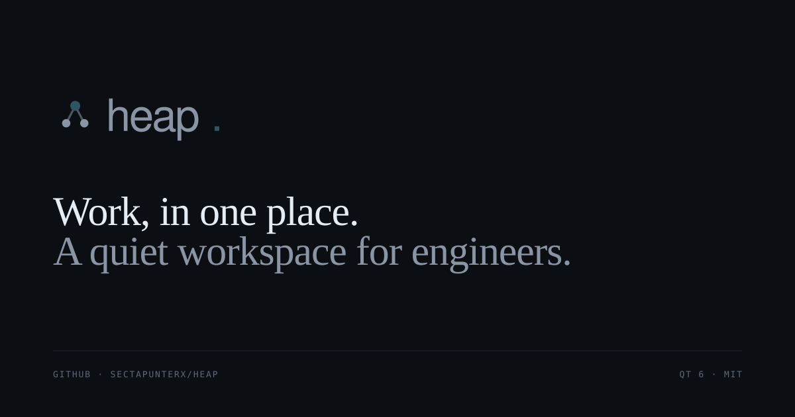
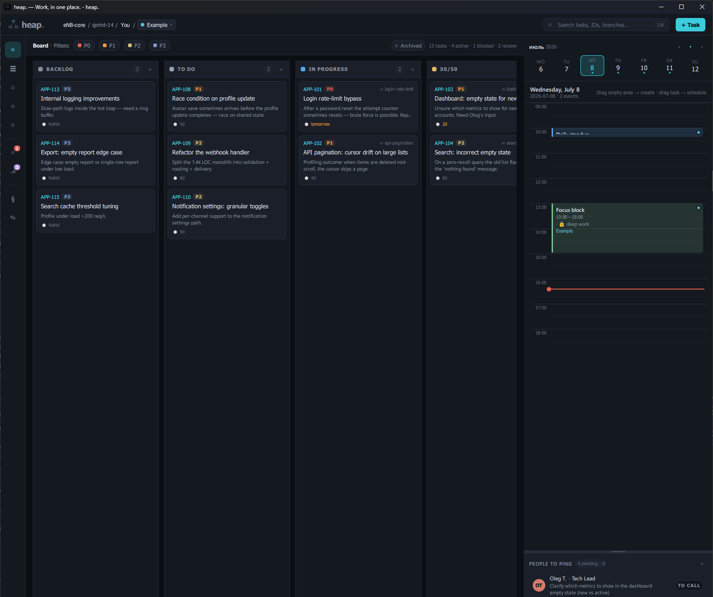
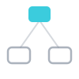
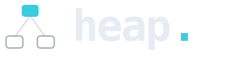

<p align="center">
  
</p>

<p align="center">
  <b>A local-first desktop workspace for engineers — board, calendar, docs, and notes in one native window.</b>
</p>

<div align="center">

[](https://github.com/sectapunterx/heap/actions/workflows/ci.yml)
[](https://github.com/sectapunterx/heap/releases)
[](https://www.qt.io/)
[](https://en.cppreference.com/w/cpp/20)
[](#license)

</div>

---

## What it is

heap. is a **single native binary** — a Qt 6 / QML application, not an Electron shell. Your tasks, calendar events,
docs, snippets, and contacts live side by side in one window and persist as a JSON blob on your own disk.

**No browser. No servers. No accounts. No telemetry.** It starts fast, runs offline, and the board is *git-aware* —
it watches your working copy and matches the current branch to the task you're on.

<p align="center">
  
</p>

## Why heap.

- **Local-first.** State is one JSON file under `QStandardPaths::AppDataLocation`, backed up daily. Your data never
  leaves the machine.
- **Git-aware.** The active branch is matched to a task by id, the matching card is decorated with its branch, and a
  focused-repo banner surfaces branch + PR state — no manual linking.
- **Keyboard-first.** A `Ctrl+K` command palette, global quick-capture from anywhere, and a fully rebindable shortcut
  map.
- **One window, six surfaces.** Board, week, day, docs, notes, people — one process, one palette, one state file.
- **Native + light.** One binary, no installer required, no runtime services. Qt 6 / C++20.

## Features

**Plan** — Kanban board (drag-and-drop columns, priority chips, branch decoration, scheduled-time pill) · Timeline
(overdue / today / week / later buckets).
**Time** — Week view (7-day grid, drag/resize/cross-day events) · Day calendar (drag-to-create, resize, drop a task to
schedule a focus block, live now-line).
**Know** — Docs (custom sections + fields, snippet editor with syntax highlighting, contact cards) · Notes (per-profile
markdown with `@people` / `#ticket` autocomplete).
**Flow** — Git-aware board · Quick-capture task / note via a global hotkey · `Ctrl+K` command palette · Profiles
(feature-scoped workspaces with JSON import/export) · Automation (60-second tick auto-archives, warns on stuck tasks,
fires deadline + standup reminders; respects quiet hours).

## Get it

**Prebuilt binaries** — a Windows installer, a Linux AppImage, and a portable zip are attached to each
[**GitHub release**](https://github.com/sectapunterx/heap/releases). Download and run; nothing else to install.

**Package managers** — Windows via [Scoop](https://scoop.sh):

```powershell
scoop bucket add heap https://github.com/sectapunterx/heap
scoop install heap
```

winget and Flathub (Linux) manifests are prepared and pending submission — see
[`docs/DISTRIBUTION.md`](docs/DISTRIBUTION.md).

**Build from source** — three commands, any platform (Qt 6.4+ and a C++20 toolchain):

```sh
cmake -S . -B build -DCMAKE_BUILD_TYPE=Release
cmake --build build -j
./build/heap                  # ./build/heap.exe on Windows
```

### Linux (Debian / Ubuntu)

```sh
sudo apt install qt6-base-dev qt6-declarative-dev libqt6svg6-dev cmake g++
cmake -S . -B build && cmake --build build -j
```

### macOS

```sh
brew install qt cmake
cmake -S . -B build -DCMAKE_PREFIX_PATH=$(brew --prefix qt)
cmake --build build -j
```

### Windows (MSYS2 UCRT64 + CLion)

1. Install [MSYS2](https://www.msys2.org/) into `C:\msys64`.
2. Open the **MSYS2 UCRT64** shell (not "MSYS" or "MinGW64").
3. Sync and install the toolchain:

   ```sh
   pacman -Syu          # restart the shell if prompted
   pacman -S --needed \
       mingw-w64-ucrt-x86_64-toolchain \
       mingw-w64-ucrt-x86_64-cmake \
       mingw-w64-ucrt-x86_64-ninja \
       mingw-w64-ucrt-x86_64-qt6-base \
       mingw-w64-ucrt-x86_64-qt6-declarative \
       mingw-w64-ucrt-x86_64-qt6-svg \
       mingw-w64-ucrt-x86_64-qt6-tools \
       git
   ```

4. Open the project in CLion. Under **Settings → Build, Execution, Deployment → Toolchains → + → MinGW**:
   - **Name:** `MSYS2 UCRT64`
   - **Toolset:** `C:\msys64\ucrt64`
5. In **Settings → CMake**, add to **CMake options**: `-DCMAKE_PREFIX_PATH=C:/msys64/ucrt64`
6. Pick the `heap` run configuration. `Shift+F10` to launch.
7. To run `heap.exe` outside CLion, add `C:\msys64\ucrt64\bin` to `PATH`, or bundle the Qt DLLs once with
   `windeployqt6 --qmldir ../qml heap.exe` from the build directory.

## Keyboard

Defaults — every entry is rebindable from **Settings → Shortcuts** or the floating Hotkeys panel. Full list:
[docs/HOTKEYS.md](docs/HOTKEYS.md).

| Action            | Default      | Action            | Default      |
| ----------------- | ------------ | ----------------- | ------------ |
| Command palette   | `Ctrl+K` / `Ctrl+P` | Quick-capture task | `Ctrl+Shift+Space` |
| New task          | `Ctrl+N`     | Quick-capture note | `Ctrl+Shift+N` |
| Board / Timeline / Week | `Ctrl+1` / `2` / `3` | Docs / Notes / Settings | `Ctrl+4` / `5` / `6` |
| Next / prev profile | `Ctrl+]` / `Ctrl+[` | Export profile → Markdown | `Ctrl+Shift+E` |
| Focus search      | `Ctrl+F`     | Undo last change  | `Ctrl+Z`     |
| Tweaks / Hotkeys  | `Ctrl+,` / `Ctrl+/` | Select all / clear / delete | `Ctrl+A` / `Esc` / `Del` |

## Documentation

- [**First day in heap.**](docs/TUTORIAL.md) — a ten-minute walkthrough, including Quick-capture syntax.
- [**Keyboard reference**](docs/HOTKEYS.md) — every (rebindable) shortcut.
- [**Data & backups**](docs/DATA.md) — where your data lives, backups, moving a profile between machines.
- [**Packaging**](docs/PACKAGING.md) — how the installer / AppImage / portable bundles are built.

## Data & backups

- **Profiles** own their tasks, people, statuses, docs, and notes. Events are global (the calendar spans every profile)
  and carry an optional `profileId`.
- **Everything** persists as JSON under `QStandardPaths::AppDataLocation`; settings live in a single `appSettingsJson`
  blob edited by `SettingsView`.
- **Backups** rotate daily under `<AppDataLocation>/backups/`; retention is configurable in **Settings → Data**. A
  corrupt state file is recovered from the newest backup rather than overwritten.

## Contributing

```sh
git clone https://github.com/sectapunterx/heap && cd heap
cmake -S . -B build && cmake --build build -j        # app
cmake --build build --target heap_all_tests          # tests
ctest --test-dir build/tests --output-on-failure     # 21 suites
```

CI (`.github/workflows/ci.yml`) runs clang-format + clang-tidy, a Linux + Windows build/test matrix, and an
ASan/UBSan pass on every PR. Work on a branch off `master` named `heap-<ticket>_<short-desc>`; keep the tree green.

## Project layout

```
.
├─ CMakeLists.txt          ← heap_core (qt_add_library + qt_add_qml_module) + thin heap exe
├─ src/
│  ├─ main.cpp             ← QApplication entry, window icon, signal handlers
│  ├─ AppController.{h,cpp}← QML_SINGLETON exposing models, profiles, automation, undo
│  ├─ Models.{h,cpp}       ← TaskModel / EventModel / PersonModel (QAbstractListModel)
│  ├─ SampleData.{h,cpp}   ← seed tasks / events / people for first run
│  ├─ CodeHighlighter.{h,cpp}  ← QSyntaxHighlighter for the docs snippet editor
│  ├─ NotesHighlighter.{h,cpp} ← markdown highlighter for the Notes view
│  ├─ chrono/              ← natural-language date parser (Quick-capture)
│  ├─ git/                 ← GitWatcher + branch↔task matcher (git-aware board)
│  ├─ text/                ← task-text classification / parsing helpers
│  ├─ notify/              ← cross-platform notifications (tray / D-Bus)
│  ├─ platform/            ← global hotkey backend (Win32 RegisterHotKey)
│  ├─ integrations/        ← tracker-sync status mapping (post-release)
│  ├─ sync/                ← BYOS serializer + 3-way JSON merge
│  └─ query/               ← Notes query-language parser
├─ qml/                    ← all views + singletons (Theme, Brand, I18n) — see below
├─ tests/                  ← GoogleTest (C++) + Qt Quick Test (QML) suites
├─ docs/                   ← single-page site + brandbook (GitHub Pages) + guides
├─ design/                 ← original React prototype (reference) + brand-export bundle
└─ README.md
```

The `qml/` tree holds one file per surface (`KanbanBoard`, `WeekView`, `DayCalendar`, `DocsView`, `NotesView`,
`PeopleList`, …), the modal editors, and the `Theme` / `Brand` / `I18n` singletons. `BrandLogo.qml` paints the mark
with native primitives so the brand renders without `Qt6::Svg`.

## Brand

Shipped under `design/brand-export/` and wired into the runtime via the `Brand` QML singleton.
Tagline: *Work, in one place.*

<table>
<tr>
<td align="center" width="33%">
  <picture>
    <source media="(prefers-color-scheme: dark)" srcset="design/brand-export/logo/heap-mark.svg">
    <source media="(prefers-color-scheme: light)" srcset="design/brand-export/logo/heap-mark-light.svg">
    
  </picture>
  <br><sub><code>BrandLogo { variant: "mark" }</code></sub>
</td>
<td align="center" width="33%">
  <picture>
    <source media="(prefers-color-scheme: dark)" srcset="design/brand-export/logo/heap-wordmark.svg">
    <source media="(prefers-color-scheme: light)" srcset="design/brand-export/logo/heap-wordmark-light.svg">
    
  </picture>
  <br><sub><code>BrandLogo { variant: "wordmark" }</code></sub>
</td>
<td align="center" width="33%">
  <picture>
    <source media="(prefers-color-scheme: dark)" srcset="design/brand-export/logo/heap-lockup.svg">
    <source media="(prefers-color-scheme: light)" srcset="design/brand-export/logo/heap-lockup-light.svg">
    
  </picture>
  <br><sub><code>BrandLogo { variant: "lockup" }</code></sub>
</td>
</tr>
</table>

Full palette, token reference, mark geometry, and asset map:
[`design/brand-export/README.md`](design/brand-export/README.md).

## License

MIT — see [LICENSE](LICENSE). Brand assets under `design/brand-export/` are MIT for use within this codebase. The
referenced fonts (IBM Plex Sans, JetBrains Mono) ship under the SIL Open Font License; see their upstream repositories.
