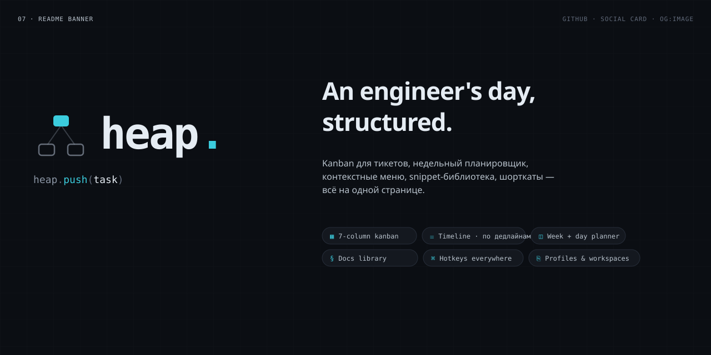

<p align="center">
  
</p>

<p align="center">
  A native desktop board, calendar, and notebook for engineers.
</p>

<div align="center">

[](https://www.qt.io/)
[](https://en.cppreference.com/w/cpp/20)
[](https://cmake.org/)
[](#license)

</div>

---

## What it is

heap. is a single-binary Qt 6 / QML application. One process, no Electron, no browser, no remote services. Tasks,
events, docs, snippets, and contacts live side by side in a per-profile workspace persisted as a JSON blob in the user
data directory.

The app was ported from a React prototype that still ships under `design/`
for visual reference. The brand bundle lives under `design/brand-export/`; see [
`design/brand-export/README.md`](design/brand-export/README.md) for tokens, mark geometry, and asset paths.

<p align="center">
  
</p>

## Highlights

- **Kanban board.** Drag-and-drop columns, status color picker, per-card priority chips, branch decoration,
  scheduled-time pill.
- **Timeline.** Overdue / today / tomorrow / week / later buckets, with sub-grouping by date and a show-done toggle.
- **Week view.** 7-day grid with all-day deadline chips and an hourly event grid. Drag, resize, and cross-day move for
  events.
- **Day calendar.** Drag-to-create events, top and bottom resize, drop a task to schedule a focus block, live now-line.
- **Docs.** Sections (3GPP, internal, C++, tools) with custom fields. Snippet editor with syntax highlighting. Contact
  cards.
- **Notes.** Per-profile markdown canvas with `@people` and `#ticket`
  autocomplete.
- **Profiles.** Feature-scoped workspaces with JSON import and export.
- **Command palette.** `Ctrl+K` fuzzy search across tasks, docs, snippets, contacts, people, and profiles.
- **Hotkeys.** Rebindable catalog with inline capture.
- **Settings.** 10 sections (profile, appearance, notifications, calendar,
  tasks, shortcuts, C++, integrations, data, about). Persists as JSON.
- **Tweaks panel.** Theme, density, accent, reduced motion, high contrast.
- **Automation.** A 60-second tick auto-archives done tasks, surfaces blocked-stuck warnings, and fires deadline and
  standup reminders via the system tray. Respects quiet hours.

## Build

Requires Qt 6.4+ and a C++20 toolchain.

```sh
cmake -S . -B build -DCMAKE_BUILD_TYPE=Release
cmake --build build -j
./build/heap                  # ./build/heap.exe on Windows
```

### Linux (Debian / Ubuntu)

```sh
sudo apt install qt6-base-dev qt6-declarative-dev libqt6svg6-dev cmake g++
```

### macOS

```sh
brew install qt cmake
cmake -S . -B build -DCMAKE_PREFIX_PATH=$(brew --prefix qt)
cmake --build build -j
```

### Windows (MSYS2 UCRT64 + CLion)

1. Install [MSYS2](https://www.msys2.org/) into `C:\msys64`.
2. Open the **MSYS2 UCRT64** shell (not "MSYS" or "MinGW64").
3. Sync and install the toolchain:

   ```sh
   pacman -Syu          # restart the shell if prompted
   pacman -S --needed \
       mingw-w64-ucrt-x86_64-toolchain \
       mingw-w64-ucrt-x86_64-cmake \
       mingw-w64-ucrt-x86_64-ninja \
       mingw-w64-ucrt-x86_64-qt6-base \
       mingw-w64-ucrt-x86_64-qt6-declarative \
       mingw-w64-ucrt-x86_64-qt6-svg \
       mingw-w64-ucrt-x86_64-qt6-tools \
       git
   ```

4. Open the project in CLion. Under **Settings → Build, Execution, Deployment → Toolchains → + → MinGW**:
   - **Name:** `MSYS2 UCRT64`
   - **Toolset:** `C:\msys64\ucrt64`
5. In **Settings → CMake**, add to **CMake options**:

   ```
   -DCMAKE_PREFIX_PATH=C:/msys64/ucrt64
   ```
6. Pick the `heap` run configuration. `Shift+F10` to launch.
7. To run `heap.exe` outside CLion, add `C:\msys64\ucrt64\bin` to `PATH`, or bundle the Qt DLLs once with
   `windeployqt6 --qmldir ../qml heap.exe` from the build directory.

## Project layout

```
.
├─ CMakeLists.txt          ← qt_add_executable + qt_add_qml_module + qt_add_resources
├─ src/
│  ├─ main.cpp             ← QApplication entry, window icon, signal handlers
│  ├─ AppController.{h,cpp}← QML_SINGLETON exposing models, profiles, automation, undo
│  ├─ Models.{h,cpp}       ← TaskModel / EventModel / PersonModel (QAbstractListModel)
│  ├─ SampleData.{h,cpp}   ← seed tasks / events / people for first run
│  ├─ CodeHighlighter.{h,cpp}  ← QSyntaxHighlighter for the docs snippet editor
│  └─ NotesHighlighter.{h,cpp} ← markdown highlighter for the Notes view
├─ qml/
│  ├─ Main.qml             ← top-level window
│  ├─ Theme.qml            ← singleton: surfaces, accent (reactive), highContrast, reducedMotion
│  ├─ Brand.qml            ← singleton: heap. palette, identity tokens, tagline, asset paths
│  ├─ BrandLogo.qml        ← lockup / mark / wordmark in native QML primitives
│  ├─ TopBar.qml           ← BrandLogo, breadcrumbs, profile pill, search, +Task
│  ├─ SideRail.qml         ← view switcher rail with badge counts
│  ├─ FilterBar.qml        ← priority chips + Archived toggle + task counts
│  ├─ KanbanBoard.qml      ← drag-and-drop board with status columns
│  ├─ TaskCard.qml         ← per-task card (priority, branch, deadline, stuck, archived)
│  ├─ TimelineView.qml     ← deadline-bucketed agenda
│  ├─ WeekView.qml         ← 7-day grid with interactive events
│  ├─ DayCalendar.qml      ← hourly grid with drag-to-create + resize handles
│  ├─ MiniWeek.qml         ← week navigator with per-day dots
│  ├─ PeopleList.qml       ← "Кому написать" todo → pinged → replied
│  ├─ DocsView.qml         ← docs canvas (sections, snippets, contacts)
│  ├─ DocsEditor.qml       ← modal editor for docs / snippets / contacts
│  ├─ NotesView.qml        ← markdown notes canvas
│  ├─ SettingsView.qml     ← 10-section settings UI
│  ├─ TweaksPanel.qml      ← floating theme / accent / a11y quick controls
│  ├─ HotkeysPanel.qml     ← rebindable shortcut catalog
│  ├─ CommandPalette.qml   ← Ctrl+K fuzzy palette
│  ├─ TaskEditor.qml       ← task modal
│  ├─ EventEditor.qml      ← event modal
│  ├─ PersonEditor.qml     ← contact modal
│  ├─ ProfileEditor.qml    ← profile create / rename / duplicate modal
│  ├─ ThinScrollBar.qml    ← shared thin translucent scrollbar
│  ├─ Toast.qml            ← bottom-centered transient notifications
│  └─ PillButton.qml       ← rounded primary / secondary button
├─ design/
│  ├─ *.jsx                ← original React prototype (reference only)
│  ├─ styles.css           ← prototype stylesheet
│  └─ brand-export/        ← heap. brand bundle: logos, app icon, surfaces, brandbook
└─ README.md
```

## State and data

- **Profile snapshot.** Each profile owns its own tasks, people, statuses,
  docs blob, and notes blob.
- **Events.** Global, so the calendar reflects every profile at once. Each event carries an optional `profileId`
  attribution.
- **Settings.** Stored as `appSettingsJson` — one JSON blob persisted via
  `QStandardPaths::AppDataLocation`. `SettingsView` is the canonical editor.
- **Backups.** Rotated daily under `<AppDataLocation>/backups/`. Retention is configurable in **Settings → Data**.

## Keyboard

Defaults. Every entry is rebindable from **Settings → Shortcuts** or the
floating Hotkeys panel.

| Action            | Default      |
| ----------------- | ------------ |
| Open palette      | `Ctrl+K` / `Ctrl+P` |
| New task          | `Ctrl+N`     |
| Switch to Board   | `Ctrl+1`     |
| Switch to Timeline| `Ctrl+2`     |
| Switch to Week    | `Ctrl+3`     |
| Switch to Docs    | `Ctrl+4`     |
| Switch to Notes   | `Ctrl+5`     |
| Switch to Settings| `Ctrl+,`     |
| Next profile      | `Ctrl+Tab`   |
| Prev profile      | `Ctrl+Shift+Tab` |
| Focus search      | `/`          |
| Undo last deletion| `Ctrl+Z`     |
| Open Tweaks       | `Ctrl+T`     |
| Open Hotkeys      | `Ctrl+Shift+K` |

## Accessibility

- **Reduced motion.** **Tweaks → Reduced motion** mutes all transitions.
  `Theme.scaledMs(n)` collapses to 0.
- **High contrast.** **Tweaks → High contrast** strengthens border and text
  tokens.
- **Tab focus.** Focusable inputs paint an accent border when focused.

## Brand

The heap. brand ships under `design/brand-export/` and is wired into the runtime via the `Brand` QML singleton. Tagline:
*Work, in one place.* Long form, for editorial contexts only: *A quiet place for the work you owe.*

<table>
<tr>
<td align="center" width="33%">
  <picture>
    <source media="(prefers-color-scheme: dark)" srcset="design/brand-export/logo/heap-mark.svg">
    <source media="(prefers-color-scheme: light)" srcset="design/brand-export/logo/heap-mark-light.svg">
    
  </picture>
  <br><sub><code>BrandLogo { variant: "mark" }</code></sub>
</td>
<td align="center" width="33%">
  <picture>
    <source media="(prefers-color-scheme: dark)" srcset="design/brand-export/logo/heap-wordmark.svg">
    <source media="(prefers-color-scheme: light)" srcset="design/brand-export/logo/heap-wordmark-light.svg">
    
  </picture>
  <br><sub><code>BrandLogo { variant: "wordmark" }</code></sub>
</td>
<td align="center" width="33%">
  <picture>
    <source media="(prefers-color-scheme: dark)" srcset="design/brand-export/logo/heap-lockup.svg">
    <source media="(prefers-color-scheme: light)" srcset="design/brand-export/logo/heap-lockup-light.svg">
    
  </picture>
  <br><sub><code>BrandLogo { variant: "lockup" }</code></sub>
</td>
</tr>
</table>

`BrandLogo.qml` paints the mark with `Rectangle` and `Canvas`, so the brand renders without `Qt6::Svg`. The exported SVG
files are bundled into
`qrc:/brand/...` for the app icon and any consumer that prefers vector assets.

### Palette

The product palette (cyan `accent`, status hues, surfaces) is the runtime UI. The identity-only tokens (`brandInk`,
`brandAccent`) are used by the mark, the wordmark, and the lockup, so the brand sits behind the product instead of
competing with it.

| token         | dark      | light     | role                                 |
|---------------|-----------|-----------|--------------------------------------|
| `bg`          | `#0b0e13` | `#f3f5f8` | app background                       |
| `bg2`         | `#11151c` | derived   | secondary surface                    |
| `panel`       | `#14181f` | `#ffffff` | cards and panels                     |
| `panel2`      | `#1a1f29` | derived   | nested cards                         |
| `border`      | `#262d39` | `#dde3ec` | dividers, hairlines                  |
| `text`        | `#e5ecf3` | `#11151c` | primary text                         |
| `text3`       | `#8a94a3` | `#5f6878` | muted, labels                        |
| `accent`      | `#3bccdd` | `#178ea0` | product accent (UI only)             |
| `accent2`     | `#5fdaea` | derived   | hover, highlight                     |
| `brandInk`    | `#8a94a3` | —         | identity ink (wordmark, mark stroke) |
| `brandAccent` | `#2f5560` | —         | identity accent (mark fill, dot)     |
| `iconInk`     | `#5f6878` | —         | app-icon mark, one stop darker       |
| `iconAccent`  | `#1f3d45` | —         | app-icon fill, one stop darker       |

| status       | hex       |
| ------------ | --------- |
| todo         | `#86a0bd` |
| in-progress  | `#32b2e7` |
| review       | `#bf94ec` |
| done         | `#78be7a` |
| warn         | `#fe9c3a` |

Full token reference and asset map:
[`design/brand-export/README.md`](design/brand-export/README.md).

## License

MIT. See [LICENSE](LICENSE) (if present), or treat this repo as MIT-licensed.

The brand assets under `design/brand-export/` are also MIT for use within this codebase. Fonts referenced (IBM Plex
Sans, JetBrains Mono) ship under the SIL Open Font License; see their upstream repositories.
