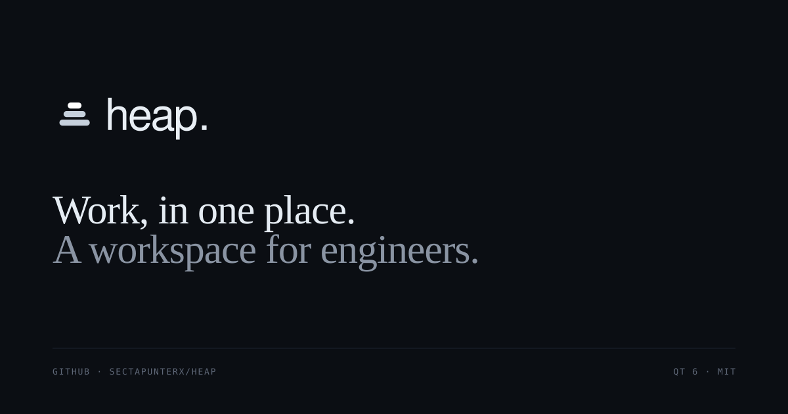
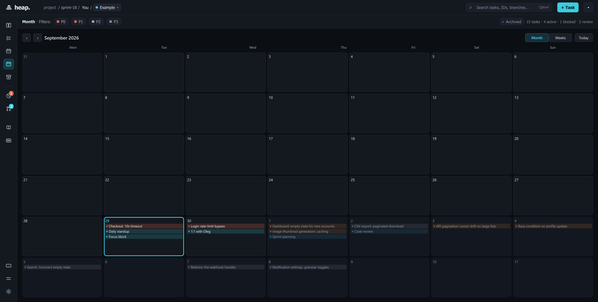
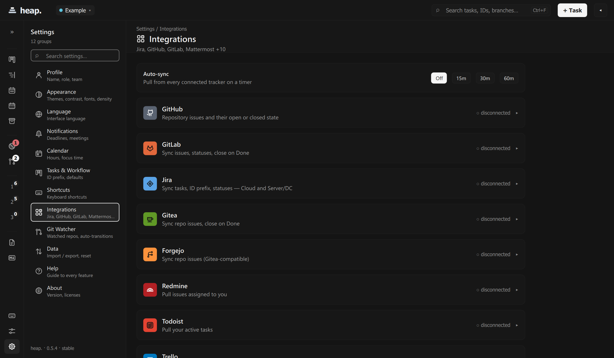
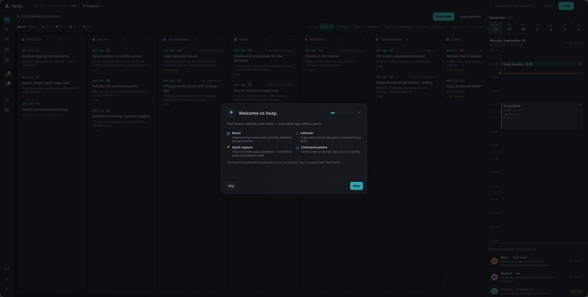

<p align="center">
  
</p>

<p align="center">
  <b>A local-first desktop workspace for engineers — board, calendar, docs, and notes in one native window.</b>
</p>

<p align="center">
  <a href="https://sectapunterx.github.io/heap/"><b>Website</b></a> ·
  <a href="https://sectapunterx.github.io/heap/demo/">Try it in the browser</a> ·
  <a href="https://sectapunterx.github.io/heap/download/">Download</a> ·
  <a href="https://sectapunterx.github.io/heap/docs/">Docs</a>
</p>

<div align="center">

[](https://github.com/sectapunterx/heap/actions/workflows/ci.yml)
[](https://github.com/sectapunterx/heap/releases)
[](https://www.qt.io/)
[](https://en.cppreference.com/w/cpp/20)
[](#license)

</div>

---

## What it is

heap. is a **single native binary** — a Qt 6 / QML application, not an Electron shell. Your tasks, calendar events,
docs, snippets, and contacts live side by side in one window and persist as a JSON blob on your own disk.

**No browser. No servers. No accounts. No telemetry.** It starts fast, runs offline, and the board is *git-aware* —
it watches your working copy and matches the current branch to the task you're on.

<p align="center">
  
</p>

## Why heap.

- **Local-first.** State is one JSON file under `QStandardPaths::AppDataLocation`, backed up daily. Your data never
  leaves the machine.
- **Git-aware.** The active branch is matched to a task by id, the matching card is decorated with its branch, and a
  focused-repo banner surfaces branch + PR state — no manual linking.
- **Connected, not locked-in.** Sync issues from GitHub, GitLab, Jira, Trello and eight more trackers, and pull the
  people you work with out of Mattermost — sign in through the browser or paste a token, credentials kept in the OS
  keychain, open/closed written back when you move a card. Your data still lives in one local file.
- **Keyboard-first.** A `Ctrl+K` command palette with full-text search, global quick-capture from anywhere, and a fully
  rebindable shortcut map.
- **One window, every surface.** Board, timeline, week, month, docs, notes, calendar, people — one process, one
  palette, one state file.
- **Native + light.** One binary, no installer required, no runtime services. Qt 6 / C++20. English and Russian.

## Features

**Plan** — Kanban board (drag-and-drop columns, priority chips, branch decoration, scheduled-time pill, recurring
tasks) · Timeline (overdue / today / week / later buckets) · Archive for closed-out tickets.

**Time** — Week view (7-day grid, drag/resize, side-by-side overlapping events, a rail of what still needs a slot) ·
Month view · Day calendar (midnight-to-midnight, drag-to-create, resize, drop a task to schedule a focus block, live
now-line) · Repeating events (daily / weekly / fortnightly / monthly / yearly, edited one occurrence, this-and-
following, or the whole series) · All-day, multi-day and past-midnight events · Meeting reminders · `.ics` import and
export · Keyboard date navigation (`T` today, arrows, `G` go to date).

**Know** — Docs (a tree of long-form markdown pages, plus the reference catalog: custom sections + fields, snippet
editor with syntax highlighting, contact cards) · Notes (many notes per profile, with folders, pinning and a daily
note; markdown editor with headings, task lists, tables, fenced code with syntax highlighting, callouts, footnotes,
`@people` / `#ticket` autocomplete and a live rendered view) · `[[Wiki-links]]` that cross from one note to another,
with backlinks and an offer to write the note a broken link was asking for · Import and export notes as a folder of
`.md` files, Obsidian-compatible.

**Connect** — Tracker integrations for GitHub, GitLab, Jira, Trello and eight more (Gitea, Forgejo, Redmine, Todoist,
Asana, ClickUp, Sentry, Bitbucket) — browser sign-in or a token, issues mirrored as cards, your statuses mapped onto
your columns, open/closed written back on column move (GitHub / GitLab / Gitea / Forgejo, each issue to its own repo),
tokens in the OS keychain, optional timed auto-sync. Mattermost
imports the people you talk to as contacts and `@handles` instead. See
[`docs/INTEGRATIONS.md`](docs/INTEGRATIONS.md).

**Flow** — Git-aware board · Quick-capture task / note via a global hotkey · `Ctrl+K` command palette (full-text search
across tasks, notes, docs & snippets) · Profiles (feature-scoped workspaces with JSON import/export) · Automation
(60-second tick auto-archives, warns on stuck tasks, fires deadline + standup reminders; respects quiet hours) ·
Undo and redo for every change · Interactive first-run guide · In-app update check.

## A look inside

<table>
<tr>
  <td width="50%" valign="top">
    <a href="docs/assets/img/screens/board-week.png"></a>
    <sub><b>Week</b> — seven days, overlapping events side by side, a rail of tasks that still need a slot.</sub>
  </td>
  <td width="50%" valign="top">
    <a href="docs/assets/img/screens/board-timeline.png"></a>
    <sub><b>Timeline</b> — every task bucketed by deadline.</sub>
  </td>
</tr>
<tr>
  <td valign="top">
    <a href="docs/assets/img/screens/board-notes.png"></a>
    <sub><b>Notes</b> — Markdown with a live rendered view, <code>[[wiki-links]]</code>, <code>@people</code>, task lists.</sub>
  </td>
  <td valign="top">
    <a href="docs/assets/img/screens/board-docs.png"></a>
    <sub><b>Docs</b> — pages and a reference catalog: sections, snippets, contacts.</sub>
  </td>
</tr>
<tr>
  <td valign="top">
    <a href="docs/assets/img/screens/board-month.png"></a>
    <sub><b>Month</b> — tasks and events across the whole month.</sub>
  </td>
  <td valign="top">
    <a href="docs/assets/img/screens/settings-integrations.png"></a>
    <sub><b>Integrations</b> — GitHub, GitLab, Jira, Trello + 8 more, and Mattermost.</sub>
  </td>
</tr>
<tr>
  <td valign="top">
    <a href="docs/assets/img/screens/hotkeys-tweaks.png"></a>
    <sub><b>Hotkeys</b> — every shortcut in one panel, rebindable in place.</sub>
  </td>
  <td valign="top">
    <a href="docs/assets/img/screens/welcome.png"></a>
    <sub><b>First run</b> — a sample board and a skippable, replayable guided tour.</sub>
  </td>
</tr>
</table>

## Get it

**Prebuilt binaries** — attached to each [**GitHub release**](https://github.com/sectapunterx/heap/releases):
a Windows installer + portable zip, a macOS `.dmg`, and a Linux AppImage. Download and run; nothing else to
install.

**Linux (any distro)** — the AppImage carries its own Qt:

```sh
chmod +x heap-*-linux-x86_64.AppImage
./heap-*-linux-x86_64.AppImage
```

Releases up to 0.5.1 also shipped a `.deb` and a tarball built against Ubuntu 24.04's Qt 6.4. The UI does not
run on Qt 6.4, so those are gone; use the AppImage.

**Package managers** — Windows via [Scoop](https://scoop.sh):

```powershell
scoop bucket add heap https://github.com/sectapunterx/heap
scoop install heap
```

winget and Flathub (Linux) manifests are prepared and pending submission — see
[`docs/DISTRIBUTION.md`](docs/DISTRIBUTION.md).

**Build from source** — three commands, any platform (Qt 6.9+ — what CI builds and tests — and a C++20 toolchain):

```sh
cmake -S . -B build -DCMAKE_BUILD_TYPE=Release
cmake --build build -j
./build/heap                  # ./build/heap.exe on Windows
```

### Linux

On a rolling distribution with a current Qt (Arch ships 6.11), the system packages are enough:

```sh
sudo pacman -S --needed qt6-base qt6-declarative qt6-svg qt6-networkauth qtkeychain-qt6 cmake ninja
```

Elsewhere distribution Qt is often too old: Ubuntu 24.04 ships 6.4, on which the UI does not run. Take Qt 6.9 from
[aqtinstall](https://github.com/miurahr/aqtinstall) (what CI does) or the Qt online installer:

```sh
pip install aqtinstall
aqt install-qt linux desktop 6.9.1 linux_gcc_64 -m qtnetworkauth -O ~/Qt
cmake -S . -B build -DCMAKE_PREFIX_PATH=~/Qt/6.9.1/gcc_64 && cmake --build build -j
```

### macOS

```sh
brew install qt cmake
cmake -S . -B build -DCMAKE_PREFIX_PATH=$(brew --prefix qt)
cmake --build build -j
```

### Windows (MSYS2 UCRT64 + CLion)

1. Install [MSYS2](https://www.msys2.org/) into `C:\msys64`.
2. Open the **MSYS2 UCRT64** shell (not "MSYS" or "MinGW64").
3. Sync and install the toolchain:

   ```sh
   pacman -Syu          # restart the shell if prompted
   pacman -S --needed \
       mingw-w64-ucrt-x86_64-toolchain \
       mingw-w64-ucrt-x86_64-cmake \
       mingw-w64-ucrt-x86_64-ninja \
       mingw-w64-ucrt-x86_64-qt6-base \
       mingw-w64-ucrt-x86_64-qt6-declarative \
       mingw-w64-ucrt-x86_64-qt6-svg \
       mingw-w64-ucrt-x86_64-qt6-tools \
       mingw-w64-ucrt-x86_64-qt6-networkauth \
       mingw-w64-ucrt-x86_64-qtkeychain \
       git
   ```

4. Open the project in CLion. Under **Settings → Build, Execution, Deployment → Toolchains → + → MinGW**:
   - **Name:** `MSYS2 UCRT64`
   - **Toolset:** `C:\msys64\ucrt64`
5. In **Settings → CMake**, add to **CMake options**: `-DCMAKE_PREFIX_PATH=C:/msys64/ucrt64`
6. Pick the `heap` run configuration. `Shift+F10` to launch.
7. To run `heap.exe` outside CLion, add `C:\msys64\ucrt64\bin` to `PATH`, or bundle the Qt DLLs once with
   `windeployqt6 --qmldir ../qml heap.exe` from the build directory.

## Keyboard

Defaults — every entry is rebindable from **Settings → Shortcuts** or the floating Hotkeys panel. Full list:
[docs/HOTKEYS.md](docs/HOTKEYS.md).

| Action            | Default      | Action            | Default      |
| ----------------- | ------------ | ----------------- | ------------ |
| Command palette   | `Ctrl+K` / `Ctrl+P` | Quick-capture task | `Ctrl+Shift+Space` |
| New task          | `Ctrl+N`     | Quick-capture note | `Ctrl+Shift+N` |
| Board / Timeline / Week / Month | `Ctrl+1` … `4` | Archive / Docs / Notes / Settings | `Ctrl+5` … `8` |
| Board cursor      | `J` `K` `H` `L` | Move the card     | `Shift`+ the same |
| Calendar: today   | `T`          | Calendar: go to date | `G`          |
| Calendar: prev / next day | `Alt+←` / `Alt+→` | New event    | `Ctrl+E`     |
| Next / prev profile | `Ctrl+]` / `Ctrl+[` | Export profile → Markdown | `Ctrl+Shift+E` |
| Focus search      | `Ctrl+F`     | Undo / redo       | `Ctrl+Z` / `Ctrl+Shift+Z` |
| Tweaks / Hotkeys  | `Ctrl+,` / `Ctrl+/` | Select all / clear / delete | `Ctrl+A` / `Esc` / `Del` |
| Weekly report     | `Ctrl+Shift+W` | Toggle theme    | `Ctrl+Shift+T` |
| Toggle right panel | `Ctrl+\`   | New person / profile | `Ctrl+Shift+U` / `Ctrl+Shift+P` |

## Documentation

- [**First day in heap.**](docs/TUTORIAL.md) — a ten-minute walkthrough, including Quick-capture syntax.
- [**Keyboard reference**](docs/HOTKEYS.md) — every (rebindable) shortcut.
- [**Tracker integrations**](docs/INTEGRATIONS.md) — connecting GitHub / GitLab / Jira / Trello and the rest.
- [**Data & backups**](docs/DATA.md) — where your data lives, backups, moving a profile between machines.
- [**Packaging**](docs/PACKAGING.md) — how the installer / AppImage / portable bundles are built.

The same guides are published, with search, at [sectapunterx.github.io/heap/docs](https://sectapunterx.github.io/heap/docs/).

## Data & backups

- **Profiles** own their tasks, people, statuses, docs, and notes. Events are global (the calendar spans every profile)
  and carry an optional `profileId`.
- **Everything** persists as JSON under `QStandardPaths::AppDataLocation`; settings live in a single `appSettingsJson`
  blob edited by `SettingsView`.
- **Backups** rotate daily under `<AppDataLocation>/backups/`; retention is configurable in **Settings → Data**. A
  corrupt state file is recovered from the newest backup rather than overwritten.

## Contributing

```sh
git clone https://github.com/sectapunterx/heap && cd heap
cmake -S . -B build && cmake --build build -j        # app
cmake --build build --target heap_all_tests          # tests
ctest --test-dir build/tests --output-on-failure
```

CI (`.github/workflows/ci.yml`) checks clang-format and clang-tidy on the changed lines, builds and tests on Linux,
Windows and macOS, runs an ASan/UBSan pass, a qmllint ratchet and actionlint, and smoke-tests the app — the `ci`
check gates the merge into `master`. A PR that only touches docs or Markdown skips the build. A nightly run
(`nightly.yml`) adds the next Qt, fuzzing, coverage and a full release build. The website in `site/` has its own
workflow (`pages.yml`); see [`site/README.md`](site/README.md). Work on a branch off `master` named
`heap-<ticket>_<short-desc>`; keep the tree green.

## Project layout

```
.
├─ CMakeLists.txt          ← heap_core (qt_add_library + qt_add_qml_module) + thin heap exe
├─ src/
│  ├─ main.cpp             ← QApplication entry, window icon, signal handlers
│  ├─ AppController.{h,cpp}← QML_SINGLETON exposing models, profiles, automation, undo
│  ├─ Logger.{h,cpp}       ← rotating file logger, installed from main
│  ├─ Models.{h,cpp}       ← TaskModel / EventModel / PersonModel (QAbstractListModel)
│  ├─ SampleData.{h,cpp}   ← seed tasks / events / people for first run
│  ├─ CodeHighlighter.{h,cpp}  ← QSyntaxHighlighter for the docs snippet editor
│  ├─ board/               ← card ranks for the manual board order
│  ├─ cal/                 ← calendar: recurrence rules, occurrences, reminders, .ics, event clamping
│  ├─ undo/                ← the undo / redo stack
│  ├─ markdown/            ← parser, block model and editor ops for Notes
│  ├─ chrono/              ← natural-language date parser (Quick-capture)
│  ├─ git/                 ← GitWatcher + branch↔task matcher (git-aware board)
│  ├─ text/                ← task-text classification / parsing helpers
│  ├─ notes/               ← note backlinks + @people / #ticket link parsing
│  ├─ recur/               ← recurring-task engine
│  ├─ query/               ← Notes query-language parser
│  ├─ notify/              ← cross-platform notifications (tray / D-Bus)
│  ├─ platform/            ← global hotkey backend (Win32 RegisterHotKey)
│  ├─ integrations/        ← tracker sync: 12 trackers + Mattermost contacts, OAuth, keychain
│  ├─ sync/                ← BYOS serializer + 3-way JSON merge (internal)
│  └─ update/              ← GitHub-releases update check
├─ qml/                    ← all views + singletons (Theme, Brand, I18n) — see below
├─ tests/                  ← GoogleTest (C++) + Qt Quick Test (QML) suites
├─ docs/                   ← guides (also published on the website) + screenshots
├─ site/                   ← the website: Astro + React islands, deployed to GitHub Pages
├─ design/                 ← original React prototype (reference) + brand-export bundle
└─ README.md
```

The `qml/` tree holds one file per surface (`KanbanBoard`, `WeekView`, `DayCalendar`, `DocsView`, `NotesView`,
`PeopleList`, …), the modal editors, and the `Theme` / `Brand` / `I18n` singletons. `BrandLogo.qml` paints the mark
with native primitives so the brand renders without `Qt6::Svg`.

## Brand

Shipped under `design/brand-export/` and wired into the runtime via the `Brand` QML singleton.
Tagline: *Work, in one place.*

<table>
<tr>
<td align="center" width="33%">
  <picture>
    <source media="(prefers-color-scheme: dark)" srcset="design/brand-export/logo/heap-mark.svg">
    <source media="(prefers-color-scheme: light)" srcset="design/brand-export/logo/heap-mark-light.svg">
    
  </picture>
  <br><sub><code>BrandLogo { variant: "mark" }</code></sub>
</td>
<td align="center" width="33%">
  <picture>
    <source media="(prefers-color-scheme: dark)" srcset="design/brand-export/logo/heap-wordmark.svg">
    <source media="(prefers-color-scheme: light)" srcset="design/brand-export/logo/heap-wordmark-light.svg">
    
  </picture>
  <br><sub><code>BrandLogo { variant: "wordmark" }</code></sub>
</td>
<td align="center" width="33%">
  <picture>
    <source media="(prefers-color-scheme: dark)" srcset="design/brand-export/logo/heap-lockup.svg">
    <source media="(prefers-color-scheme: light)" srcset="design/brand-export/logo/heap-lockup-light.svg">
    
  </picture>
  <br><sub><code>BrandLogo { variant: "lockup" }</code></sub>
</td>
</tr>
</table>

Full palette, token reference, mark geometry, and asset map:
[`design/brand-export/README.md`](design/brand-export/README.md).

## License

MIT — see [LICENSE](LICENSE). Brand assets under `design/brand-export/` are MIT for use within this codebase. The
referenced fonts (IBM Plex Sans, JetBrains Mono) ship under the SIL Open Font License; see their upstream repositories.
