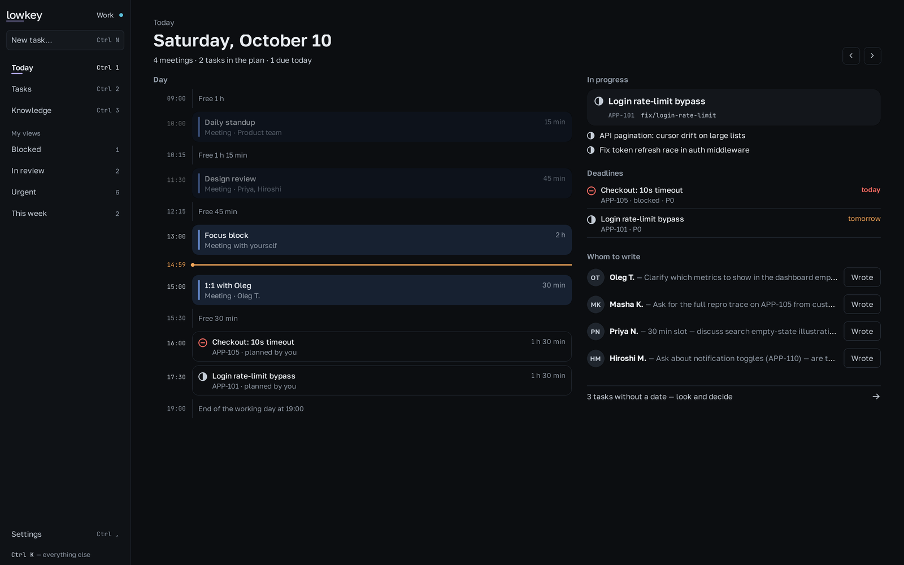
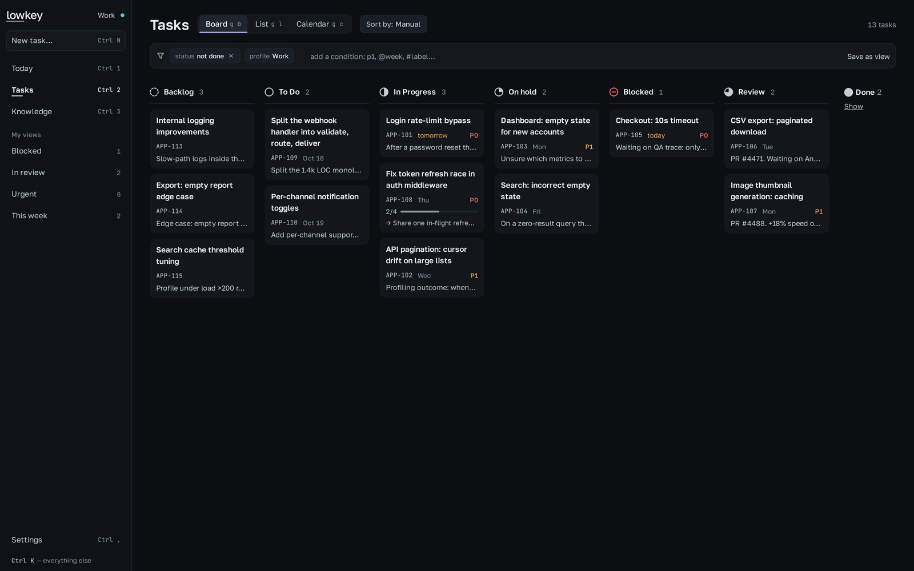
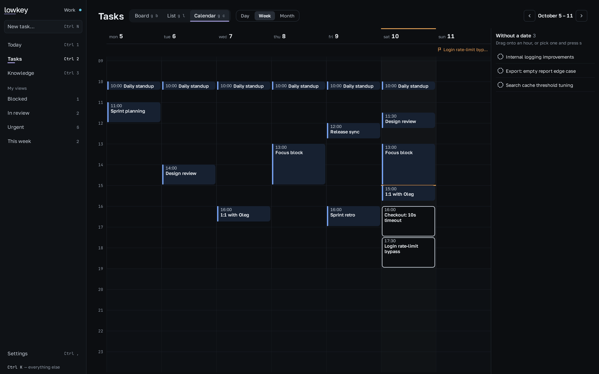
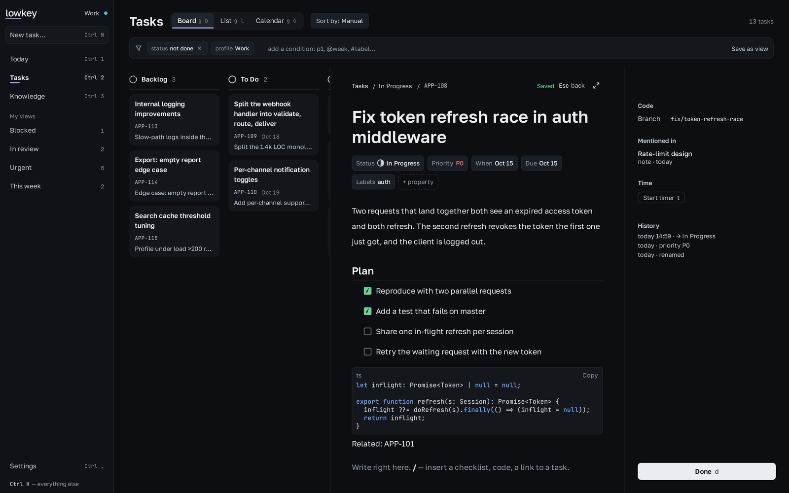
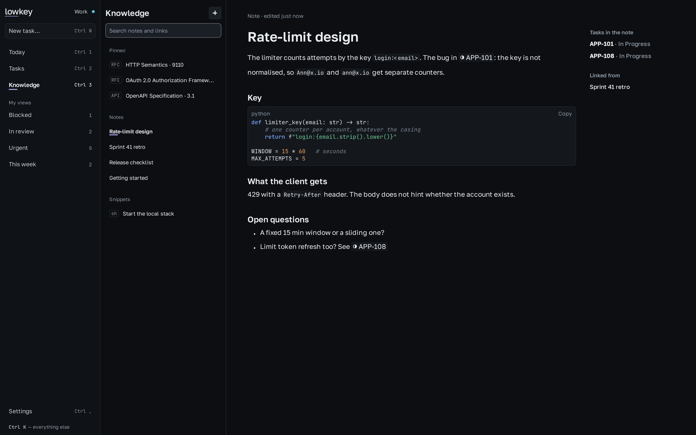
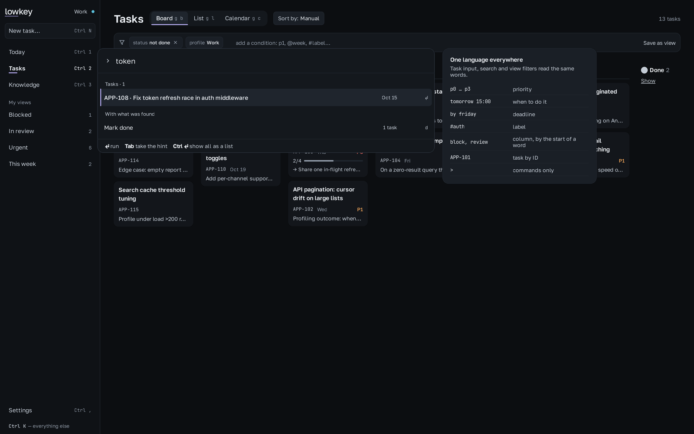
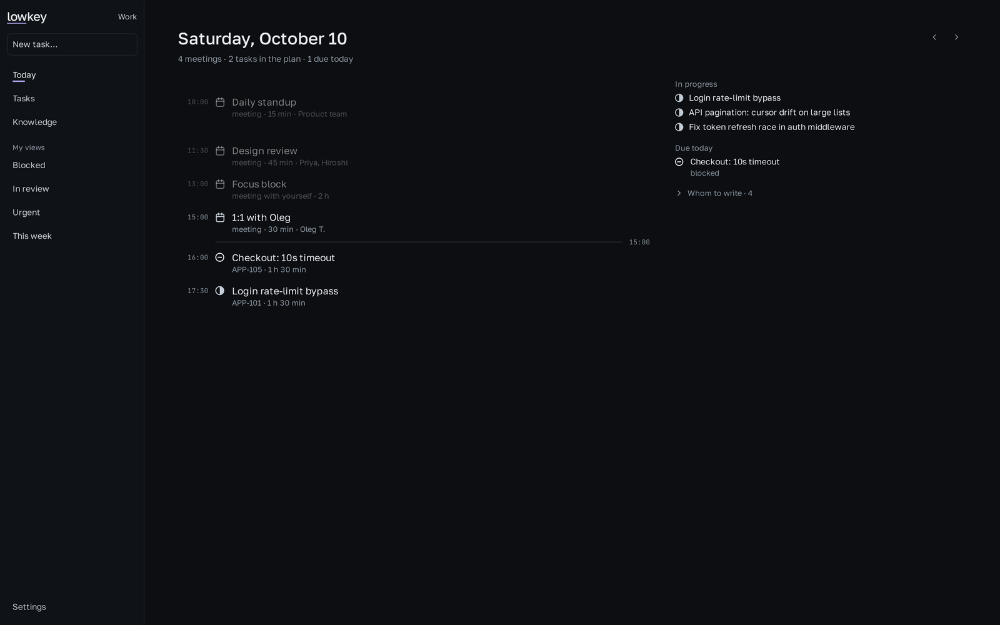

<p align="center">
  <picture>
    <source media="(prefers-color-scheme: dark)" srcset="design/brand-export/lowkey/lowkey-wordmark-on-dark.svg">
    
  </picture>
</p>

<h3 align="center">Quiet by default.</h3>

<p align="center">
  <a href="https://github.com/sectapunterx/lowkey/releases/latest"><b>Download</b></a> ·
  <a href="https://sectapunterx.github.io/lowkey/">The tour on the website</a> ·
  <a href="#docs">Docs</a>
</p>

<p align="center">
  
</p>

<p align="center">
  <a href="https://github.com/sectapunterx/lowkey/releases"></a>
  <a href="LICENSE"></a>
</p>

If your work lives in someone else's tracker, your meetings in a calendar tab and your notes in a third
place, this is a desk of your own next to all of that. Your assigned issues, today's meetings and your
notes sit in one native window on Windows, macOS or Linux, and you drive it from the keyboard. It is free,
MIT-licensed, needs no account, and the website has the full tour:
<https://sectapunterx.github.io/lowkey/>.

This page is the practical side: whether it fits you, what it will and won't touch, and how to get going.

## Is it for you?

**Probably yes, if:**

- you take tasks from GitHub, GitLab, Jira, Trello, Gitea, Forgejo, Redmine, Todoist, Asana, ClickUp,
  Sentry or Bitbucket — one of them or several at once;
- you'd rather press `j` than reach for the mouse, and you already know what `g g` does;
- you want your plans in a file on your own disk, readable with any text editor;
- you keep notes in Markdown, maybe in an Obsidian vault.

**Probably not, if:**

- you need a shared board for your team — it is a personal desk, the team's tracker stays the shared place;
- you want something to plan your day for you — it shows you the facts and leaves the decisions to you;
- you need live sync between machines today — moving work between computers is export and import for now;
- you work from a phone — there is no mobile or web version.

## What changes once it's installed

**Mornings start on one screen.** Today puts the meetings and tasks of the day together, with what is in
progress and what is due. Calendars come in by link (Outlook, Google, iCloud `.ics`), read-only.

**Thoughts stop getting lost.** `Ctrl+Shift+Space` opens a capture line over whatever app you are in.
Type `review PR tomorrow 11:00 p1 #api` — date, time, priority and label are read from the words, in
English or Russian. `Ctrl+Shift+N` does the same for a note.

**Your branch tells it what you're on.** Add a repository in Settings → Git. Check out `APP-112-…` and
APP-112 shows at the top of the window; the PR state comes from your own `gh` or `glab`. Switching to the
branch also moves the task to In Progress — one switch in the same settings turns that off.

**Tickets get your private layer.** On any tracker task you can keep your own notes, checklist, tags and
dates. A sync never overwrites them, and none of it goes back to the tracker.

**Notes link to work.** Write `#APP-112` in a note and it becomes a link carrying the task's title. Bring an
existing folder of `.md` files in — you see what will come in before anything is copied.

<table>
  <tr>
    <td width="50%"><br>Board: your tasks by status, one keypress per move</td>
    <td width="50%"><br>Week: meetings and planned tasks side by side</td>
  </tr>
  <tr>
    <td width="50%"><br>A task opens as a document: plan, code, history</td>
    <td width="50%"><br>Knowledge: Markdown notes linked to tasks</td>
  </tr>
  <tr>
    <td width="50%"><br><code>Ctrl+K</code>: find anything, run any command</td>
    <td width="50%"><br>The Quiet style: the same day, less on screen</td>
  </tr>
</table>

## What it won't do without asking

- **Write to your trackers.** Issues come in read-only. Changing an issue's status when you move its card
  is a separate switch per tracker (GitHub, GitLab, Gitea, Forgejo, Jira), off until you turn it on — and
  even then the issue is checked again before anything is sent. Titles, descriptions and comments are
  never written. Details: [docs/INTEGRATIONS.md](docs/INTEGRATIONS.md).
- **Phone home.** No analytics, no crash reports. The app checks for a new version on start — you can
  turn that off in Settings → About — and installs one only when you click to update. The rest of its
  traffic is what you connected yourself: trackers, calendar links, `gh`/`glab` for added repositories.
- **Run in the background.** It works while its window or tray icon is open. Starting at login is off
  until you switch it on.
- **Lose your work.** A backup of your data is made daily by default (the newest 20 are kept), plus a time
  machine of snapshots you can step back through.

## Install

From [the latest release](https://github.com/sectapunterx/lowkey/releases/latest), where `X.Y.Z` is the
version:

| System | File |
| --- | --- |
| Windows | `lowkey-vX.Y.Z-windows-setup.exe` — installer, or `lowkey-vX.Y.Z-windows-portable.zip` — unzip anywhere and run `lowkey.exe` |
| macOS | `lowkey-vX.Y.Z-macos.dmg` — open it and drag the app into Applications |
| Linux | `lowkey-vX.Y.Z-linux-x86_64.AppImage` — `chmod +x` and run; Qt is inside, nothing else to install |

With [Scoop](https://scoop.sh) on Windows:

```sh
scoop bucket add lowkey https://github.com/sectapunterx/lowkey
scoop install lowkey
```

Uninstalling leaves your data folder in place.

## Ten keys to start with

| Key | What it does |
| --- | --- |
| `Ctrl+Shift+Space` | Capture a task from any app |
| `Ctrl+K` | Command line — find anything, run any command |
| `?` | Every key on one screen |
| `Ctrl+1` / `Ctrl+2` / `Ctrl+3` | Today, Tasks, Knowledge |
| `g b` · `g l` · `g c` | Board, list, calendar |
| `j` `k` · `h` `l` | Move the cursor |
| `d` | Done — on a done task, brings it back |
| `s` | Schedule the task under the cursor |
| `y y` · `y b` | Copy the task id · its branch name |
| `/` | Filter the section you are in |

Single letters only act while you aren't typing. Keys are read by their place on the keyboard, so they
work in any layout, and every one of them can be changed from the `?` screen. The full map is in
[docs/HOTKEYS.md](docs/HOTKEYS.md).

The filter line takes conditions as well as words — the same in board, list and calendar:

```
status:blocked   due:week   scheduled:none   is:overdue   priority:p0,p1
#label   branch:login   estimate:>2h   has:notes   sprint:current   -status:done   bug OR crash
```

## The terminal is part of it

```sh
lowkey today                                  # overdue first, then what's on today
lowkey add "fix login tomorrow 14:00 p1 #backend"
lowkey now                                    # the current task — fits a shell prompt
```

With the window open, changes show up there at once. On Windows the command is `lowkey-cli`. The rest,
including a starship snippet: [docs/CLI.md](docs/CLI.md).

## Where your data lives

| Windows | macOS | Linux |
| --- | --- | --- |
| `%APPDATA%\lowkey\lowkey\` | `~/Library/Application Support/lowkey/lowkey/` | `~/.local/share/lowkey/lowkey/` |

- `state.json` — tasks, meetings, notes and settings, in one human-readable file.
- `backups/` and `history/` — scheduled copies and time-machine snapshots.
- `logs/lowkey.log` — attach it to a bug report.
- Tracker tokens are kept out of `state.json`: in the system credential store on Windows, in a
  `secrets.json` readable only by your user on macOS and Linux.

Two computers: export a profile to JSON and import it on the other one — importing only adds, it never
overwrites. More in [docs/DATA.md](docs/DATA.md).

## Docs

- [Keyboard](docs/HOTKEYS.md) — every key, and how to rebind them
- [Trackers](docs/INTEGRATIONS.md) — connecting each one; what is read, what may be written
- [Data and backups](docs/DATA.md) — files, restores, moving between machines
- [Command line](docs/CLI.md)
- [Building from source](docs/BUILDING.md)

## Building from source

You need Qt 6.9 or newer and a C++20 compiler:

```sh
cmake -S . -B build -DCMAKE_BUILD_TYPE=Release
cmake --build build -j
```

Per-platform setup is in [docs/BUILDING.md](docs/BUILDING.md); the code map and how to contribute are in
[CONTRIBUTING.md](CONTRIBUTING.md). Bug reports and pull requests are welcome — please include
`logs/lowkey.log`.

## License

MIT — see [LICENSE](LICENSE). The bundled fonts (Golos Text, JetBrains Mono) are under the SIL OFL 1.1; see
[THIRD_PARTY_NOTICES.md](THIRD_PARTY_NOTICES.md).
