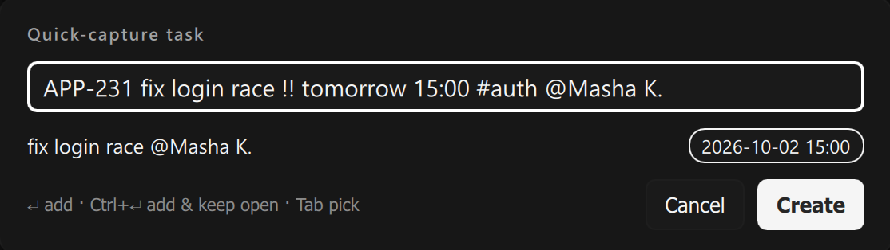
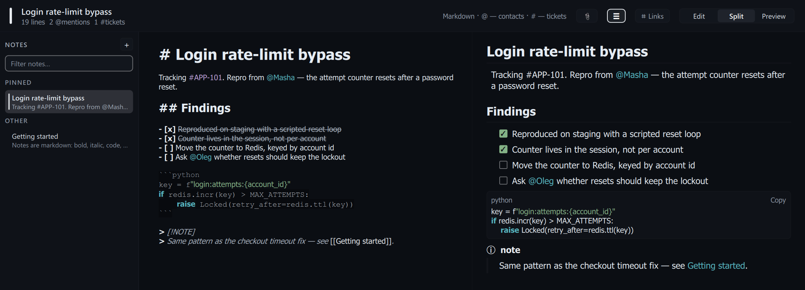

  

<h3 align="center">Quiet by default.</h3>

A developer’s workday in one window — tickets, meetings and notes, from the keyboard. 
Formerly <b>heap</b>. Same app, same data — it moves over on the first start.

  <a href="https://github.com/sectapunterx/heap/releases/latest"><b>Download lowkey</b></a> ·
  <a href="https://sectapunterx.github.io/heap/">Website</a> ·
  <a href="https://sectapunterx.github.io/heap/#try">Try it in the browser</a>

No sign-up · Works offline · Windows, macOS, Linux · Free and open source

  

## Eight tabs just to know what to do next?

Tracker, calendar, mail, notes, chat — each with its own notifications and its own counters. By the time you have
checked them all, the morning is gone.

lowkey gathers the tasks from your trackers and the meetings from your calendar into one feed for the day. It
shows what is on now and what is due today, and colour marks only what is urgent. Then it gets out of the way: it
never plans your day for you, never moves a task on its own, and never writes to your tracker unless you tell it to.

**Works with** GitHub, GitLab, Jira, Trello, Gitea, Forgejo, Redmine, Todoist, Asana, ClickUp, Sentry and
Bitbucket — plus Mattermost for the people you work with and any calendar that gives you an `.ics` link.

## What a day with lowkey looks like

### Open it and know what’s next

**Today** is the first thing you see: meetings and tasks on one timeline, the free windows between them, and a
plain fact about the load — *meetings 2 h, tasks 3 h, free 1 h 30 min*. Overdue work and deadlines sit beside it,
and so does the list of people you promised to answer.

### Write a task the way you’d say it

`Ctrl+Shift+Space` from any app, even with lowkey minimized. One line, and the date, time, priority, labels and
people are picked up on their own — in English or Russian. Every guess shows as a chip you can take back with one
click.

  

| You type | You get |
| --- | --- |
| `APP-231 fix login race with @Masha !! tomorrow 15:00 #auth` | task `APP-231`, priority P1, planned for tomorrow at 15:00, labelled `auth`, linked to Masha |
| `send the release notes by friday` | a task due Friday — the deadline, apart from the day you plan to do it |
| `review PRs every weekday 10:00` | a task that repeats every weekday at 10:00 |
| `1:1 with @anna thursday 12:00` | a task for Thursday at 12:00; tick *Also a meeting* and it is a 1:1 on the calendar with Anna |

Full syntax: [First day in lowkey](docs/TUTORIAL.md#quick-capture-syntax)

### Switch the branch — the task is already marked

Point lowkey at your repositories. Check out `APP-112-flaky-sync-test` and the task shows at the top of the
window with its pull request state; the card on the board carries the branch. No bindings, no plugins, no copying
ticket numbers.

### Every tracker, one board — and your own layer on top

Board, List or Calendar: one set of tasks, one query line on top of all three. Type `status:blocked due:week` and
it turns into chips you can remove one by one; save it as a view and it waits in the sidebar.

Tracker cards are yours to work with. Keep your own due date and priority next to the tracker’s, a private
notepad, a checklist that breaks the ticket into steps, your own labels, links to other tickets and pull requests,
and a comment draft you copy over when it is ready. A sync never overwrites any of it. Merge requests where you
are the reviewer or the assignee show up on their own, read-only.

### Plan the day by hand, with the facts in front of you

The calendar zooms from a day to a week to a month. Each day says how full it is — *6 h of 8* — and the next free
window counts both your meetings and your task blocks, so “schedule at the next free slot” never lands on top of
something. Unfinished work moves on when you say so: to tomorrow, to a free window, to someday, or off the
calendar. lowkey shows; you decide.

### Notes that link to your work

Notes and docs live in one Knowledge section. `[[APP-101]]` in a note shows the task’s current status, and the
task lists the notes that mention it; `[[Wiki-links]]` keep their backlinks. Bring your Obsidian vault in, take it back out as plain
Markdown files.

  

### Never reach for the mouse

Keys as in Vim: `j` and `k` through any list, `d` for done, `g` to go, `y` to copy. They follow the physical key,
so they work in any keyboard layout, and single letters never fire while you are typing. `Ctrl+K` is a command
line that finds, filters and runs in one place. Press `?` and every key is on one screen — and any of them can be
rebound.

### Bold by default, quiet when you want it

The bold style puts fills, counters, the colour of what is urgent and key hints on screen. Quiet takes all of that
away: outlines instead of fills, colour only where it means something. Switch in Settings, no restart.

### Right next to your repo, too

`lowkey today` in the terminal shows the overdue and the day’s tasks; `lowkey sched . tomorrow 14:00` plans the
task your branch names; `lowkey now` fits into your shell prompt. [Command line →](docs/CLI.md)

## Yours, and only yours

- **A file on your disk.** Tasks, meetings and notes live in one file. Scheduled backups and a time machine with
  hourly and daily snapshots: deleted something by accident — bring it back. [Where it lives →](docs/DATA.md)
- **No account, no telemetry.** Download, open, work. No analytics, no crash reports.
- **Read-only trackers by default.** Writing a status back is a switch you turn on per tracker. Titles,
  descriptions and comments are never written.
- **Nothing in the background.** It runs while its window or tray icon is open, and starts at login only if you
  ask it to.
- **Native.** A desktop app, not a website in a window.
- **Free and open source** under MIT. No paid tier, no trial.

## Questions

**Does it work offline?** Completely. The network is used only for the update check and for the trackers and
calendars you connect yourself.

**Can my team share a board?** No — it is a personal workspace. Shared work stays in your team’s tracker; lowkey
pulls it in and, by default, writes nothing back.

**Can I use it on two machines?** Export a profile and import it on the other one — importing only adds, never
overwrites. Or copy the data file while the app is closed.

**I use heap 0.7. What happens to my data?** heap is now called lowkey. On the first start your data is copied to
the new folder once, and the old folder is left untouched. The update check in 0.7 finds the new version by
itself.

**Which languages?** English and Russian, switchable in Settings.

## Get lowkey

Free, for Windows, macOS and Linux — [**download the latest release**](https://github.com/sectapunterx/heap/releases/latest).

- **Windows** — installer, or a portable zip that runs from any folder
- **macOS** — `.dmg`: open it and drag lowkey into Applications
- **Linux** — one AppImage for any distro: `chmod +x lowkey-*.AppImage && ./lowkey-*.AppImage`

Then press `Ctrl+Shift+Space` and write your first task.

## Documentation

- [**First day in lowkey**](docs/TUTORIAL.md) — a ten-minute walkthrough
- [**Keyboard reference**](docs/HOTKEYS.md) — every key, and how to change it
- [**Tracker integrations**](docs/INTEGRATIONS.md) — connecting GitHub, Jira and the rest
- [**Data & backups**](docs/DATA.md) — where your data lives, moving between machines
- [**Command line**](docs/CLI.md) — lowkey from the terminal

## Contributing

Issues and pull requests are welcome. Building from source, tests and the code map are in
[CONTRIBUTING.md](CONTRIBUTING.md).

## License

MIT — see [LICENSE](LICENSE). Brand assets under `design/brand-export/` are MIT for use within this codebase. The
fonts bundled into the app (Golos Text, JetBrains Mono) are SIL OFL 1.1; see
[THIRD_PARTY_NOTICES.md](THIRD_PARTY_NOTICES.md).
