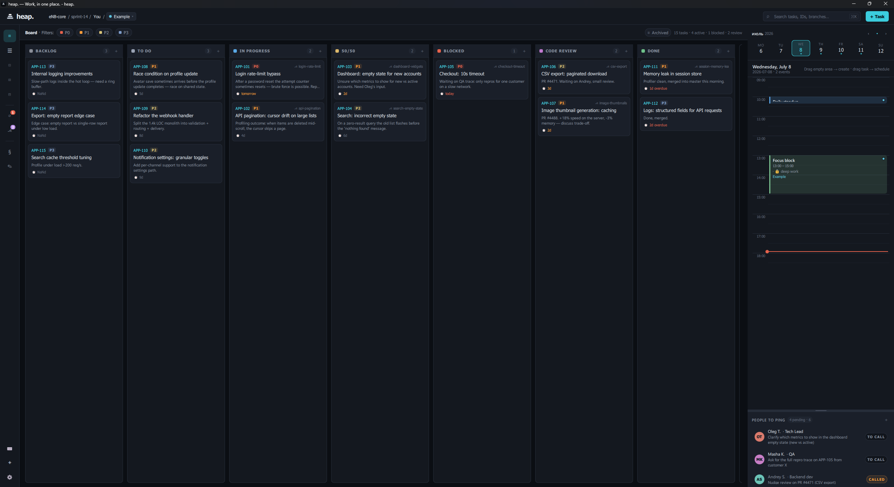
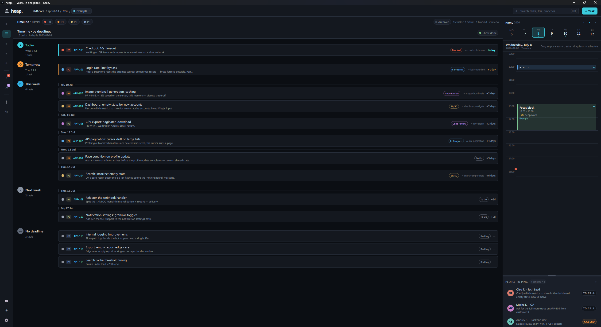
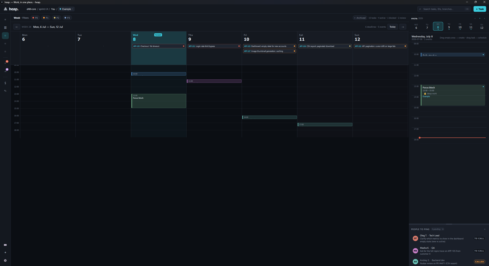
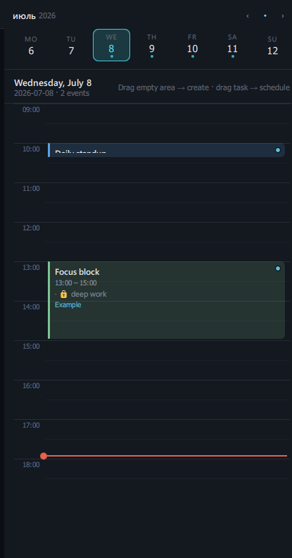
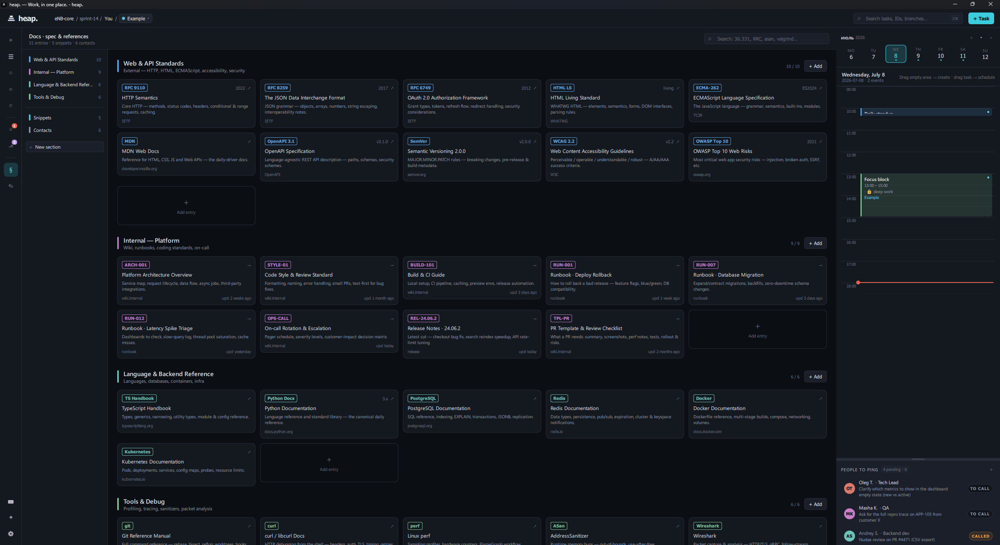
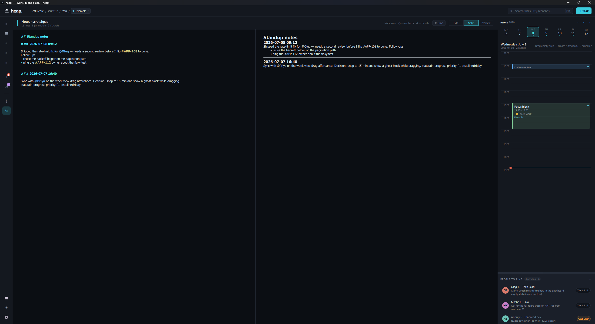
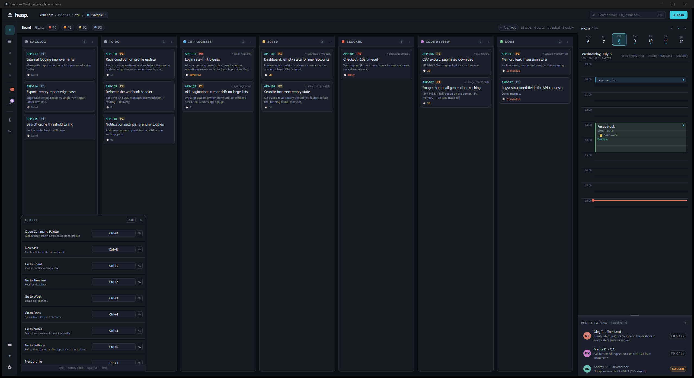

# Your first day in heap.

A ten-minute walkthrough of the whole app. heap. is one native binary — no
account, no server, no browser. Everything you create lives on your machine.

> Keyboard-first throughout. The full shortcut list is in
> [HOTKEYS.md](HOTKEYS.md); the essentials appear inline below.

## 1. Launch & the layout

On first run heap. seeds an **Example** profile so nothing is empty. The window
has three regions: the **side rail** (view switcher, left), the **main view**
(center), and the **calendar + people** column (right).

Switch views with `Ctrl+1…6`: **Board**, **Timeline**, **Week**, **Docs**,
**Notes**, **Settings**.

## 2. Capture a task in under two seconds

Press **`Ctrl+Shift+Space`** for Quick-capture, type a line, hit `Enter`. The
popup previews what it parsed (date chip, title) before you commit.

### Quick-capture syntax

Everything is optional and order-independent:

| You type | heap. does |
|----------|-----------|
| `fix login race` | task titled "fix login race" in the active profile's To Do |
| `ship v1 tomorrow` / `ship v1 завтра 14:00` | task with a parsed deadline (date, and time when given) |
| `pay invoice // net-30, portal is slow` | text after `//` becomes the task **description** |
| `review PR @andrey @lena` | keeps the `@mentions` and links them to matching people |
| `напиши @viktor про релиз` | routes to a **contact ping** in the People column, not the board |
| `focus refactor parser 10:00` | schedules a **focus block** on today's calendar |
| `standup 10:00` / `созвон 15:00-15:30` | schedules a **meeting** event (honours a time range) |
| `задача: подготовить синк` | stays a pure to-do — never put on the calendar |

Dates parse in **English and Russian** (`tomorrow`, `friday`, `завтра`,
`пятница`, `May 22`, `22.05`, `14:00`, `12:00-13:00`).

Prefer a full form? `Ctrl+N` opens the task editor with every field.

## 3. Work the board

- **Drag** cards between status columns; the color of each column is editable.
- Cards show a **priority chip** (P0–P3), a **branch** tag, a **deadline**, and
  a scheduled-time pill when a focus block exists.
- **Multi-select:** `Ctrl+A` selects everything visible; then move, archive, or
  `Del` (undoable for 5 s). `Esc` clears the selection.
- Toggle **Archived** in the filter bar to see auto-archived done tasks.

## 4. See it by time

- **Timeline** (`Ctrl+2`) buckets tasks into overdue / today / tomorrow / this
  week / later, with a show-done toggle.
  
- **Week** (`Ctrl+3`) is a 7-day grid — drag, resize, and move events across
  days; all-day deadline chips sit on top.
  
- The **day calendar** (right column) lets you drag on empty space to create an
  event, resize from either edge, and **drop a task onto it to schedule a focus
  block**. Overlapping events sit side-by-side.
  

## 5. Docs & Notes

- **Docs** (`Ctrl+4`): sections, custom fields, a syntax-highlighted snippet
  editor, and contact cards.
  
- **Notes** (`Ctrl+5`): a per-profile markdown canvas with `@people` and
  `#ticket` autocomplete. `Ctrl+Shift+N` appends a quick note from anywhere.
  

## 6. Profiles

A **profile** is a feature-scoped workspace: its own tasks, people, statuses,
docs and notes. Create one from the profile pill in the top bar, cycle with
`Ctrl+]` / `Ctrl+[`, and export the active profile to Markdown with
`Ctrl+Shift+E`. Full JSON import/export lives in **Settings → Data** — see
[DATA.md](DATA.md).

## 7. Command palette & tweaks

- **`Ctrl+K`** (or `Ctrl+P`) — fuzzy search across tasks, docs, snippets,
  contacts, people and profiles. Enter jumps straight to the item.
- **`Ctrl+,`** — Tweaks: theme, density, accent, reduced motion, high contrast.
- **`Ctrl+/`** — rebind any shortcut inline.

## 8. It nudges you

A background tick (every 60 s) auto-archives long-done tasks, flags tasks that
have been *blocked* too long, and fires **deadline** and **standup** reminders
through the system tray — all muted during **quiet hours** (Settings →
Notifications).

---

That's the whole surface. Next: skim [HOTKEYS.md](HOTKEYS.md) once, then just
live in Quick-capture.
