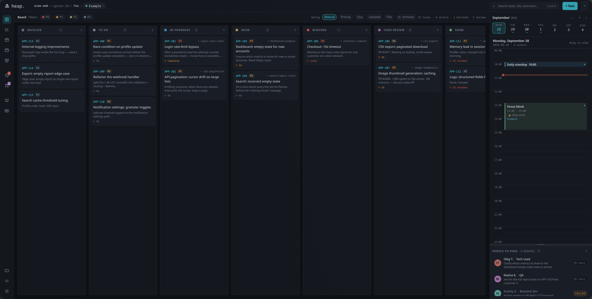
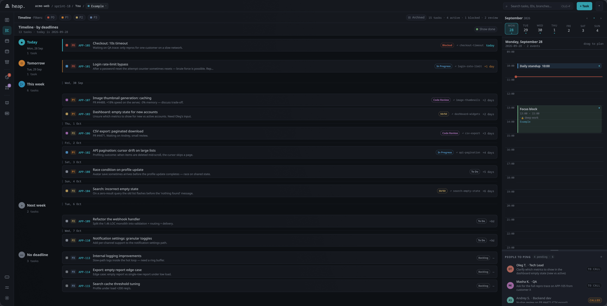
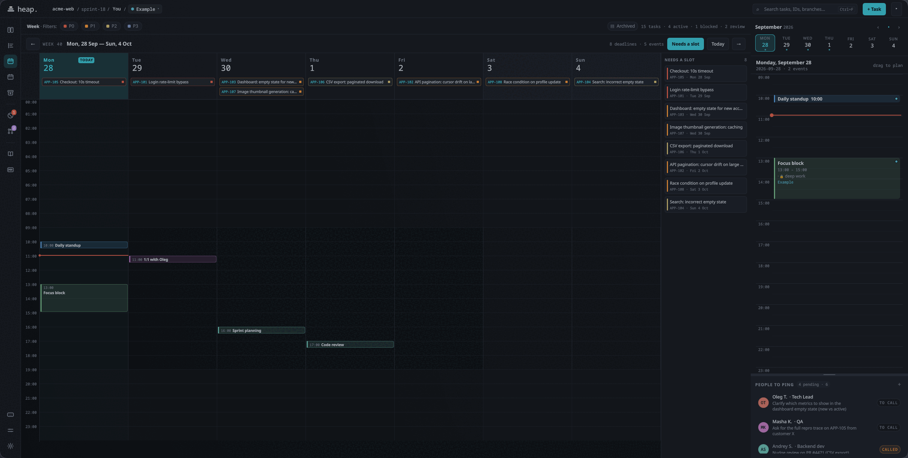
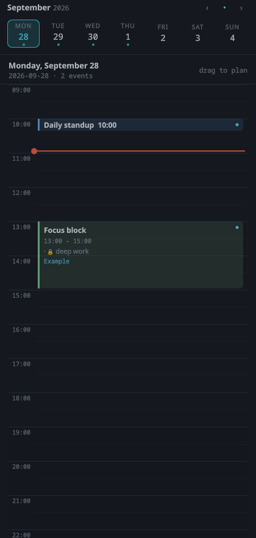
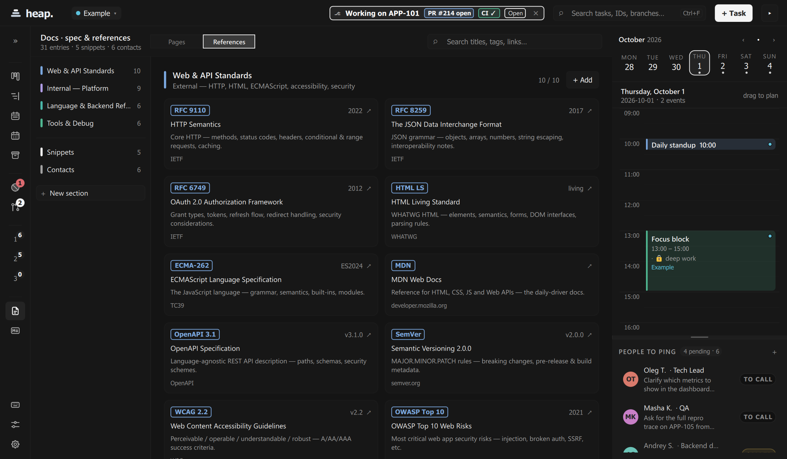
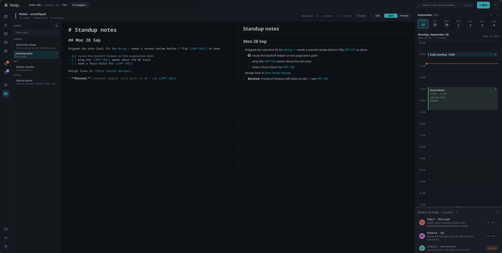
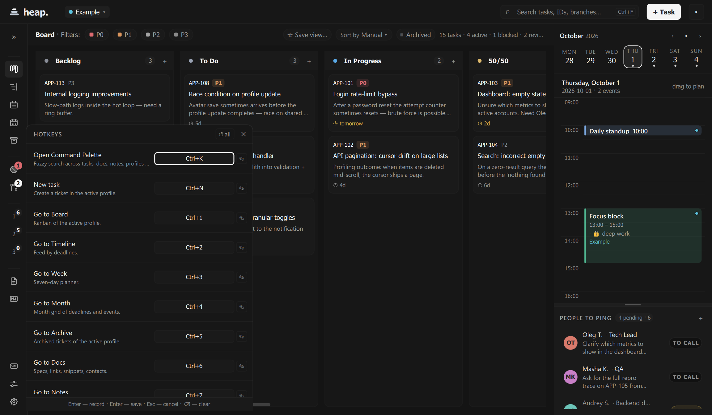

# Your first day in heap.

A ten-minute walkthrough of the whole app. heap. is one native binary — no
account, no server, no browser. Everything you create lives on your machine.

> Keyboard-first throughout. The full shortcut list is in
> [HOTKEYS.md](HOTKEYS.md); the essentials appear inline below.

## 1. Launch & the layout

On first run heap. seeds an **Example** profile so nothing is empty. The window
has three regions: the **side rail** (view switcher, left), the **main view**
(center), and the **calendar + people** column (right).



Switch views with `Ctrl+1…8`, in side-rail order: **Board**, **Timeline**,
**Week**, **Month**, **Archive**, **Docs**, **Notes**, **Settings**. Hover a
rail icon to see its shortcut.

## 2. Capture a task in under two seconds

Press **`Ctrl+Shift+Space`** for Quick-capture, type a line, hit `Enter`. The
popup previews what it parsed (date chip, title) before you commit.

It works from **any app**. When heap. is not the focused window, the hotkey
brings up only the capture line, over whatever you are working in. The main
window stays minimized, in the tray or behind your editor. `Esc` puts it away.
Clicking elsewhere does too, except for a quick note that already has text in
it: that one waits for `Enter` or `Esc`. `Ctrl+Shift+N` does the same for a
quick note.

After saving, heap. tells you what it made: a system notification when you
captured from another app, a toast when heap. was in front. For example:

```
Meeting added to the calendar
“call with @lena”
Tomorrow, Thu 1 Oct, 16:00–16:30
With: Lena
Note: pricing
Also a task in “To Do”
```

Clicking the notification opens the task.

### Quick-capture syntax

Everything is optional and order-independent, in **English and Russian**.

**What it is**

| You type | heap. does |
|----------|-----------|
| `fix login race` | task in the active profile's To Do |
| `APP-231 fix login race` | the ticket key becomes the task's **id** (and leaves the title) |
| `pay invoice // net-30, portal is slow` | text after `//` becomes the task **description** |
| `review PR @andrey @lena` | keeps the `@mentions` and links them to matching people |
| `urgent fix prod` / `p1 fix prod` / `fix prod !!` | sets the **priority**: `p0`–`p3`, `!!` (P1), `!!!` (P0), `urgent`/`asap`/`срочно` (P1), `critical`/`blocker` (P0), `не срочно` (P3) |

**When**

| You type | heap. does |
|----------|-----------|
| `ship v1 tomorrow` / `ship v1 завтра 14:00` | a deadline: the date, and the time when given |
| `report by friday` / `отчёт к пятнице` / `до понедельника` | a deadline on that day |
| `tomorrow morning`, `tonight`, `завтра утром`, `вечером` | a time from the part of the day (morning 9:00, afternoon 15:00, evening 19:00, tonight 20:00) |
| `every weekday`, `every monday`, `по будням`, `каждый будний день` | a **repeating** task |
| `in 2 days`, `через 3 дня`, `end of month` | relative dates |

**Where it lands**

| You type | heap. does |
|----------|-----------|
| `standup 10:00` / `дейли в 10:00` / `планёрка 9:30` | a **Standup** event |
| `1:1 with @anna thursday 12:00` | a **1:1** event, with Anna as an attendee |
| `sync with the backend 15:00` / `синк` | a **Team sync** event |
| `call with @lena 4pm` / `созвон 15:00-15:30` / `retro`, `demo`, `interview`, `встреча` | a one-off meeting (**No type**), honouring a time range |
| `focus refactor parser 10:00` | a **focus block** on the calendar |
| `встреча с дизайнером` (no time) | a task only; the notification says it is not on the calendar |
| `bug …`, `task …`, `задача: подготовить синк` | stays a pure to-do, never put on the calendar |
| `ping @viktor about the release` / `напиши @viktor про релиз` | a **contact ping** in the People column, not the board |

A meeting also creates a task linked to it. Russian words match in any case:
`созвона`, `встрече` and `синке` work as well as `созвон`, `встреча` and
`синк`.

Other date forms: `friday`, `пятница`, `May 22`, `22.05`, `14:00`,
`12:00-13:00`.

Prefer a full form? `Ctrl+N` opens the task editor with every field.

## 3. Work the board


- **Drag** cards between status columns; the color of each column is editable.
- Cards show a **priority chip** (P0–P3), a **branch** tag, a **deadline**, and
  a scheduled-time pill when a focus block exists.
- **Multi-select:** `Ctrl+A` selects everything visible; then move, archive, or
  `Del` (undoable for 5 s). `Esc` clears the selection.
- Toggle **Archived** in the filter bar to see auto-archived done tasks.

## 4. See it by time

- **Timeline** (`Ctrl+2`) buckets tasks into overdue / today / tomorrow / this
  week / later, with a show-done toggle.
  
- **Week** (`Ctrl+3`) is a 7-day grid — drag, resize, and move events across
  days; all-day deadline chips sit on top.
  
- The **day calendar** (right column) lets you drag on empty space to create an
  event, resize from either edge, and **drop a task onto it to schedule a focus
  block**. Overlapping events sit side-by-side. Week, Month and Settings open
  with the column folded, since they are a calendar or have nothing to plan
  against; `Ctrl+\` brings it back.
  

## 5. Docs & Notes

- **Docs** (`Ctrl+6`): sections, custom fields, a syntax-highlighted snippet
  editor, and contact cards.
  
- **Notes** (`Ctrl+7`): a per-profile markdown canvas with `@people` and
  `#ticket` autocomplete. `Ctrl+Shift+N` appends a quick note from anywhere.
  

  Write in full markdown: headings, nested lists, task lists, tables, fenced
  code with syntax highlighting, block quotes, footnotes, and callouts such as
  `> [!WARNING] Mind the migration`. `Ctrl+Shift+M` cycles edit → split →
  preview; in split the two panes scroll together, clicking a rendered block
  puts the cursor on the line that produced it, and ticking a checkbox in the
  preview rewrites exactly one character of the source — undoable like any
  other edit. The formatting keys are in [HOTKEYS.md](HOTKEYS.md#notes-editor).

  Searching (`Ctrl+K`) finds notes by section rather than as one blob, so a hit
  reads as `Notes › Release › Windows` and opens at that heading.

  Images in a note render from disk. A remote image (`https://…`) is shown as a
  link you can choose to follow rather than being fetched, because heap makes no
  network requests you did not ask for.

## 6. Profiles

A **profile** is a feature-scoped workspace: its own tasks, people, statuses,
docs and notes. Create one from the profile pill in the top bar, cycle with
`Ctrl+]` / `Ctrl+[`, and export the active profile to Markdown with
`Ctrl+Shift+E`. Full JSON import/export lives in **Settings → Data** — see
[DATA.md](DATA.md).

## 7. The search box is a query box

`Ctrl+F` focuses the header search. Typing words searches the obvious things —
title, id, description, branch, and for a mirrored issue also its tracker key,
labels, assignee, project and milestone. Typing `field:value` filters instead:

| Clause | Means |
| --- | --- |
| `status:blocked` | one status, or `status:todo,prog` for several |
| `priority:P0,P1` | any of these priorities |
| `deadline:<friday` | before a date. `<` `<=` `>` `>=` and a bare date all work |
| `deadline:7d` | offsets too: `3d`, `2w`, `1m` — and `deadline:none` for unscheduled |
| `tag:infra` | any of the task's labels |
| `mention:@ada` | the assignee, or an `@name` in the title or description |

Clauses combine with AND, and mix freely with ordinary words:
`status:blocked priority:P0 login` is the blocked P0 tasks whose text mentions
login. Dates understand what the task editor understands, so `deadline:<friday`
and `deadline:<2026-09-24` are both fine. A typo in a date drops that clause
rather than emptying the board. The magnifier turns accent-coloured when what
you typed is being read as a query.

This works the same on the board, the timeline, the week and month calendars
and the archive.

## 8. Command palette & tweaks

- **`Ctrl+K`** (or `Ctrl+P`) — fuzzy search across tasks, docs, snippets,
  contacts, people and profiles. Enter jumps straight to the item.
- **`Ctrl+,`** — Tweaks: theme, density, accent, reduced motion, high contrast.
- **`Ctrl+/`** — rebind any shortcut inline.



## 9. It nudges you

A background tick (every 60 s) auto-archives long-done tasks, flags tasks that
have been *blocked* too long, and fires **deadline**, **meeting** and
**standup** reminders through the system tray. During **quiet hours**
(Settings → Notifications) a reminder is held and delivered when the quiet
window ends; a meeting or the standup is an appointment and still reminds.
A reminder is never repeated, not even after a restart.

---

That's the whole surface. Next: skim [HOTKEYS.md](HOTKEYS.md) once, then just
live in Quick-capture.
